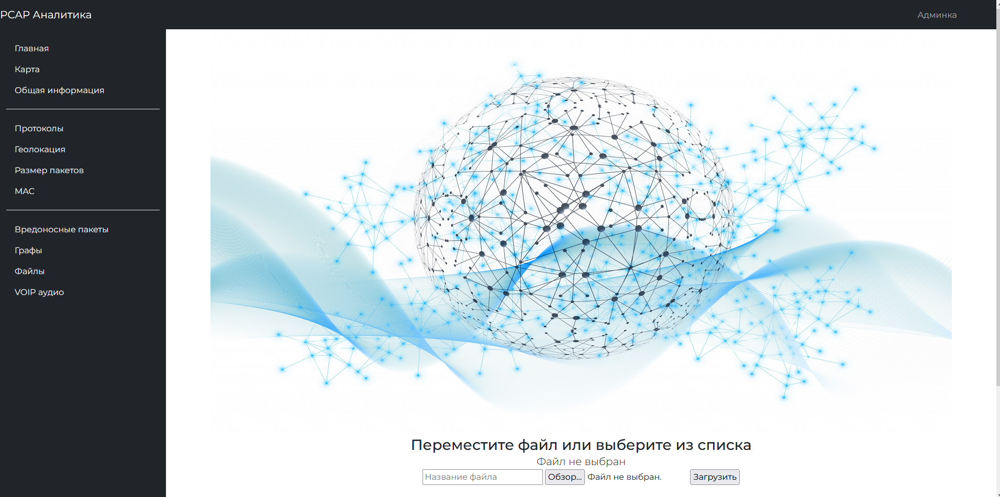
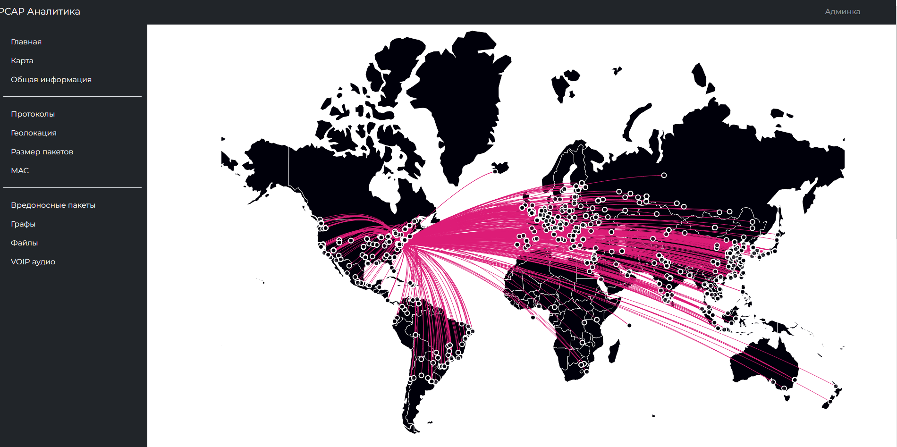
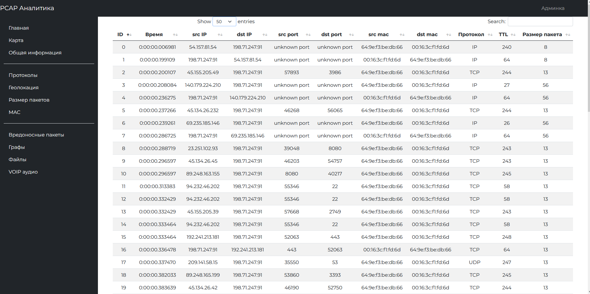
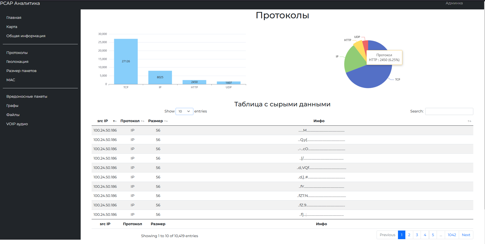
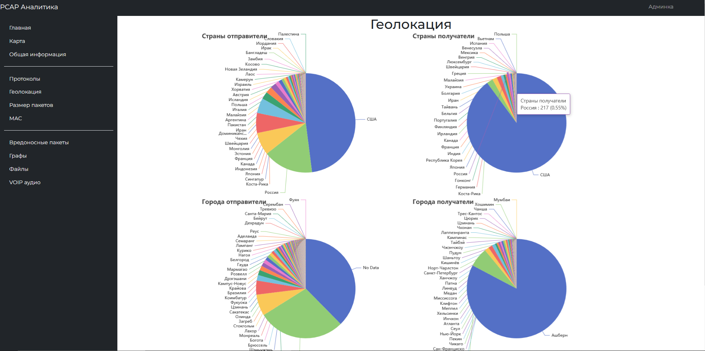
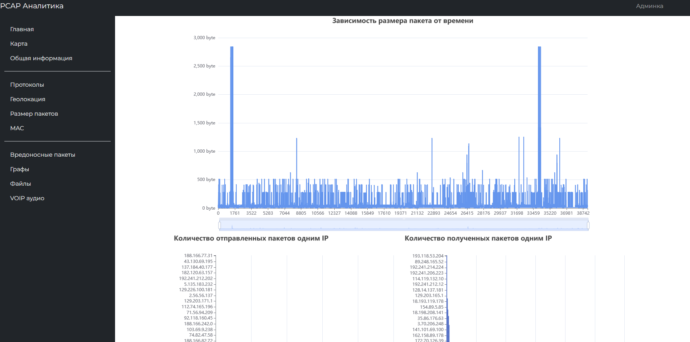
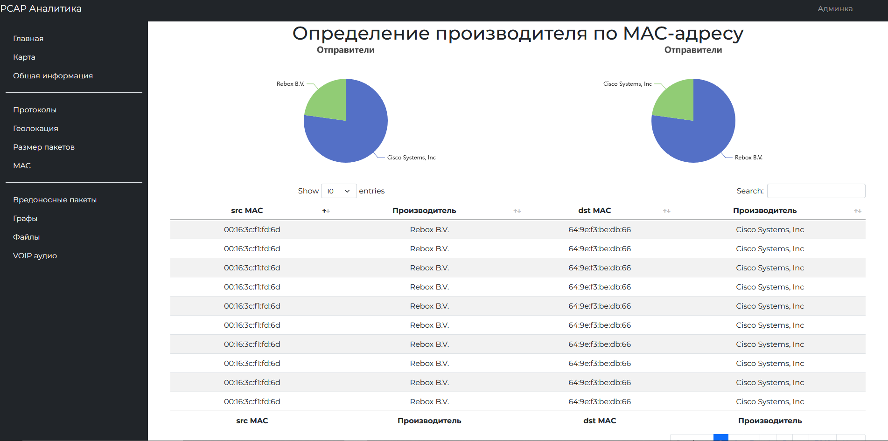
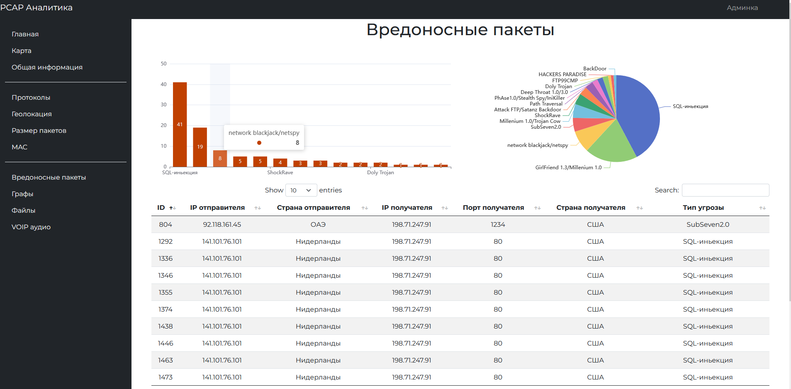

# PCAP Analyzer
### Веб-приложение с визуализацией сетевого трафика и различными результатами анализа

## Установка
```
pip install -r requirements.txt
```
## Запуск
- Выполнить команду
```
 python manage.py runserver
```
- Выбрать PCAP файл в главном окне.

## Примечание
Программа разрабатывалась на Ubuntu. Вкладки VOIP и Графы работают только на Linux

## Главная страница

## Карта

## Общая информация

## Протоколы

## Геолокация

## Размер пакетов

## МАС

## Вредоносные пакеты
